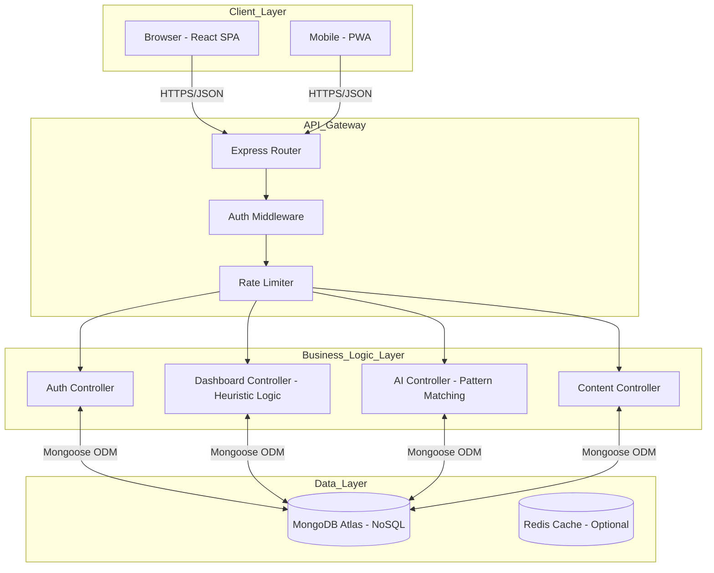
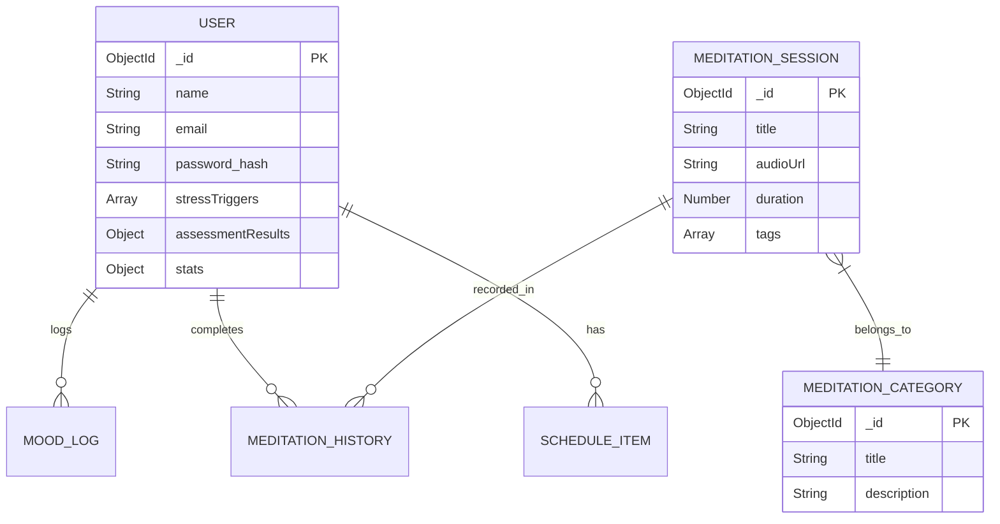
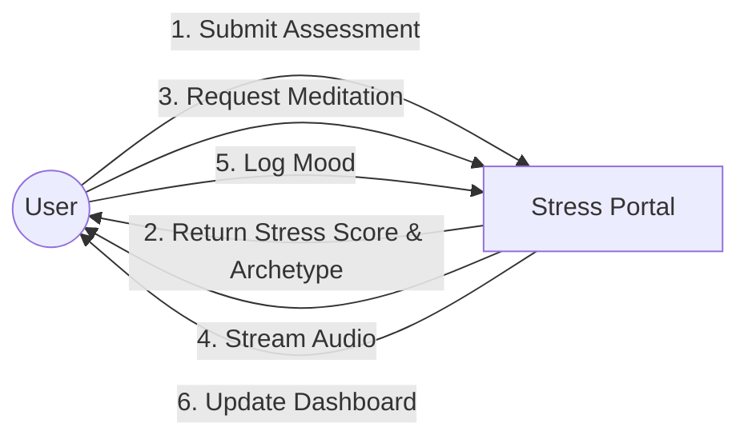

# CHAPTER 4: SYSTEM DESIGN

## 4.1 SYSTEM ARCHITECTURE

The application implements a robust **Three-Tier Architecture** utilizing the MERN Stack (MongoDB, Express.js, React.js, Node.js). This separation of concerns ensures modularity, scalability, and ease of maintenance.

### 4.1.1 Architectural Diagram

### 4.1.2 Component Description

1.  **Client Layer (Presentation):** Built with React.js using Functional Components and Hooks. It manages the DOM updates via a Virtual DOM, ensuring smooth animations (using Framer Motion) essential for a calming user experience.
2.  **API Layer (Application):** Serves as the bridge. It validates requests, handles JWT authentication, and routes traffic to specific controllers.
3.  **Data Layer (Persistence):** MongoDB Atlas stores unstructured JSON-like documents (Users, Sessions), allowing for flexible schema evolution as new features (e.g., journaling) are added.

## 4.2 DATABASE DESIGN

The database follows a **NoSQL Document-Oriented** model. This was chosen over SQL because:

- **Flexibility:** User profiles store variable data (e.g., erratic mood logs, nested arrays of triggers).
- **Performance:** Mongoose allows for deep population of related documents (e.g., fetching a User with their full Meditation History) in a single query.

### 4.2.1 Entity-Relationship Diagram (ERD)

### 4.2.2 Schema Definitions

**1. User Schema**
This is the central entity.

- `stressTriggers`: Array of strings (e.g., "Work", "Family"). Used for initial filtering.
- `assessmentResults`: Stores the `stressScore` (0-100) and `archetype` ("The Busy Bee"). The recommendation engine reads this field primarily.
- `stats`: Stores gamification data (`totalMinutes`, `currentStreak`, `lastMeditated`). This is updated atomically to prevent race conditions.

**2. MeditationSession Schema**

- `duration`: Stored in seconds to allow precise calculation of stats.
- `tags`: Array of keywords (e.g., "anxiety", "morning"). The AI Chatbot queries this field using regex matching.

## 4.3 DATA FLOW DESIGN (DFD)

### 4.3.1 Level 0 DFD (Context Diagram)

### 4.3.2 Level 1 DFD (Assessment Process)

1.  User submits `answers[]`.
2.  `AIController` calculates `weighted_sum`.
3.  Controller maps Score -> Archetype.
4.  Controller queries `SessionCollection` explicitly filtering by Archetype.
5.  Controller generates a 5-day `Schedule` array.
6.  System saves `Schedule` to `User` document.

## 4.4 INTERFACE DESIGN

The User Interface (UI) is designed based on **Color Psychology** principles to induce a physiological state of calm.

### 4.4.1 Color Palette Table

| Color Name       | Hex Code  | Psychology              | Usage                     |
| :--------------- | :-------- | :---------------------- | :------------------------ |
| **Sage Green**   | `#2e5c55` | Growth, Balance, Rest   | Primary Buttons, Headers  |
| **Pastel Peach** | `#e8dcb8` | Warmth, Comfort, Safety | Mood Cards, Backgrounds   |
| **Mint Cream**   | `#f1f3e0` | Cleanliness, Airiness   | Main Dashboard Background |
| **Soft Gold**    | `#e8a83e` | Optimism, Energy        | Highlights, Streaks       |

### 4.4.2 Wireframe Descriptions

**1. Home/Dashboard:**

- **Header:** "Good Morning, [Name]" with a dynamic greeting adjusting to the time of day.
- **Main Card:** "Daily Recommendation" featuring a large, inviting visual of nature.
- **Stats Bar:** A discreet row showing the current streak (Fire icon) avoiding aggressive red colors.
- **Quick Actions:** Circular icons for "Breathe", "Sleep", "Journal".

**2. Meditation Player:**

- **Minimalism:** The player removes all navigation bars to prevent distraction.
- **Focus:** A central pulsing circle ("Breathing Animation") guides the user's breath visually.
- **Controls:** Simple Play/Pause and a "Heart" icon to favorite the session.

**3. Assessment Page:**

- **Step-by-Step:** One question per screen to avoid overwhelming the user ("Cognitive Tunneling").
- **Progress:** A subtle progress bar at the top indicates completion status.

---

**[End of Chapter 4]**
