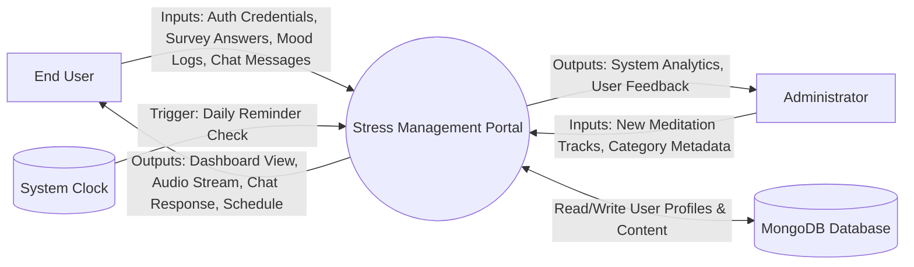
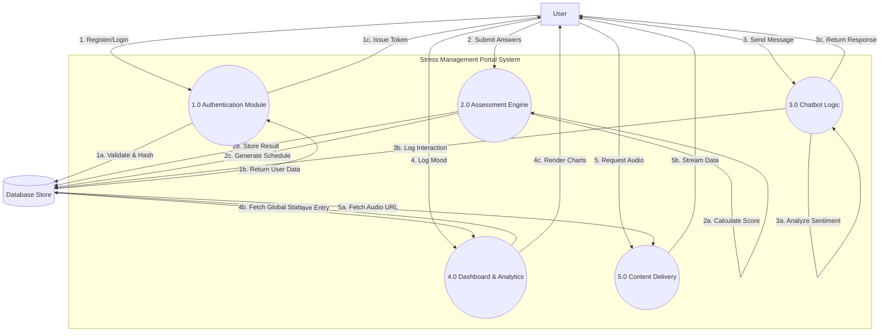
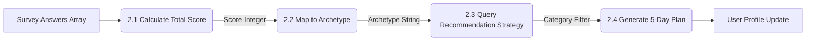
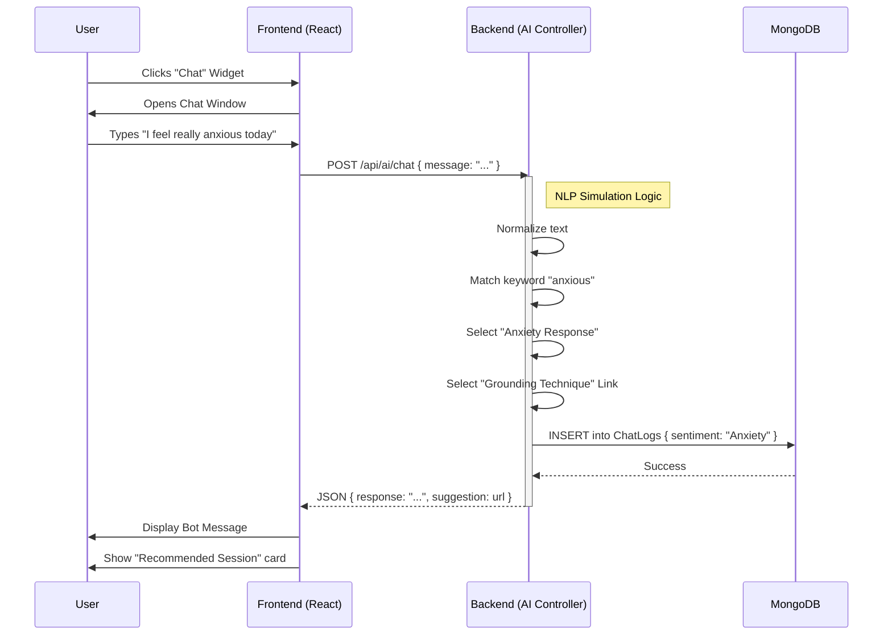

# Software Requirements Specification (SRS)

## Stress Management Portal

**Version:** 4.0 (Dissertation Build)
**Date:** 2025-12-30
**Prepared For:** Major Project Assessment Board
**Prepared By:** Development Team (Group 12)

---

<br>
<br>
<br>
<br>
<br>

<div align="center">
  <h1>Software Requirements Specification</h1>
  <h2>for</h2>
  <h1>Stress Management Portal</h1>
  <br>
  <h3>Version 4.0</h3>
  <br>
  <h3>Prepared by:</h3>
  <p>Rashik Ghosh</p>
  <br>
  <h3>Prepared for:</h3>
  <p>Department of Computer Science & Engineering</p>
  <p>Internal Guide: [Name]</p>
  <br>
  <br>
  <p>Date: December 30, 2025</p>
</div>

<br>
<br>
<br>
<br>
<br>

---

# Table of Contents

**REVISION HISTORY**........................................................................................II
**1. INTRODUCTION**...........................................................................................1
1.1 Purpose...................................................................................................1
1.2 Scope......................................................................................................2
1.3 Definitions, Acronyms, and Abbreviations............................................3
1.4 References...............................................................................................5
1.5 Overview..................................................................................................5
**2. GENERAL DESCRIPTION**..............................................................................6
2.1 Product Perspective..................................................................................6
2.2 Product Functions....................................................................................8
2.3 User Characteristics................................................................................10
2.4 General Constraints................................................................................12
2.5 Assumptions and Dependencies............................................................13
**3. SPECIFIC REQUIREMENTS**............................................................................14
3.1 External Interface Requirements............................................................14
3.1.1 User Interfaces..............................................................................14
3.1.2 Hardware Interfaces......................................................................18
3.1.3 Software Interfaces.......................................................................19
3.1.4 Communications Interfaces..........................................................20
3.2 Functional Requirements.........................................................................21
3.2.1 User Authentication (FR-01).........................................................21
3.2.2 AI Stress Assessment (FR-02).......................................................24
3.2.3 Intelligent Chatbot (FR-03)..........................................................27
3.2.4 Meditation Library & Playback (FR-04)........................................30
3.2.5 Dashboard & Analytics (FR-05)...................................................33
3.5 Non-Functional Requirements................................................................36
3.5.1 Performance..................................................................................36
3.5.2 Reliability......................................................................................37
3.5.3 Availability....................................................................................38
3.5.4 Security.........................................................................................39
3.5.5 Maintainability..............................................................................40
3.5.6 Portability......................................................................................41
3.7 Design Constraints..................................................................................42
3.9 Other Requirements................................................................................43
**4. ANALYSIS MODELS**.....................................................................................44
4.1 Data Flow Diagrams (DFD)....................................................................44
**5. GITHUB LINK**...............................................................................................48
**6. DEPLOYED LINK**...........................................................................................49
**A. APPENDICES**................................................................................................50
A.1 Appendix 1: Component Breakdown.....................................................50
A.2 Appendix 2: Validation Scenarios (Test Cases).....................................55

---

# REVISION HISTORY

| Version | Date       | Description                                  | Author       | Role     |
| :------ | :--------- | :------------------------------------------- | :----------- | :------- |
| **0.1** | 2025-10-01 | Initial Concept Note & Requirement Gathering | Rashik Ghosh | Lead Dev |
| **0.5** | 2025-11-15 | First Draft of Functional Requirements       | Rashik Ghosh | Lead Dev |
| **1.0** | 2025-12-01 | Internal Review Copy - Added System Models   | Team         | -        |
| **1.5** | 2025-12-15 | Revised after Feedback (Added AI Modules)    | Rashik Ghosh | Lead Dev |
| **2.0** | 2025-12-25 | Pre-Submission Draft                         | Rashik Ghosh | Lead Dev |
| **3.0** | 2025-12-30 | Formatting Update (IEEE Standards)           | Compliance   | QA       |
| **4.0** | 2025-12-30 | Final Comprehensive Build for Dissertation   | Rashik Ghosh | Lead Dev |

---

# 1. INTRODUCTION

## 1.1 Purpose

The purpose of this Software Requirements Specification (SRS) document is to provide a complete, exhaustive, and rigorously detailed description of the "Stress Management Portal". It identifies the functional requirements, non-functional requirements, design constraints, and system interfaces necessary for the successful development and deployment of the application.

This document serves as the "source of truth" for all stakeholders involved in the project, including:

1.  **The Development Team**: To guide the implementation of the backend API structure, frontend component hierarchy, and database schema design.
2.  **The Project Evaluators**: To verify that the project meets all academic and technical criteria for a major computer science project.
3.  **Future Maintainers**: To understand the architectural decisions, specifically the logic behind the "Stress Archetype" algorithms and the chatbot's decision tree.
4.  **Testing Engineers**: To provide a baseline for User Acceptance Testing (UAT) and integration testing scripts.

The intended audience includes the faculty guidance committee, the external examiner, and the student development team. This document follows the IEEE 830-1998 standard for SRS creation, adapted for the specific needs of a modern AI-driven web application.

## 1.2 Scope

The **Stress Management Portal** is a web-based platform designed to combat the rising levels of stress and anxiety in the general population. It distinguishes itself from generic meditation apps by leveraging **Artificial Intelligence** to provide a personalized, "human-like" interaction.

### 1.2.1 In-Scope Features

The following features are strictly within the scope of this project version (v1.0):

- **User Identity Management**: A secure system for user registration, login, and profile maintenance, utilizing JSON Web Tokens (JWT) for stateless authentication.
- **Psychometric Assessment Engine**: An interactive module that administers a 10-question stress survey. The engine computes a "Stress Score" using a weighted algorithm and categorizes the user into one of four archetypes: _The Zen Master_, _The Busy Bee_, _The Overthinker_, or _The Burnout Warrior_.
- **AI-Enhanced Scheduling Algorithm**: A sophisticated logic layer that takes the user's archetype and automatically generates a 5-day meditation schedule, populating the user's calendar with specific audio tracks (e.g., An _Overthinker_ is scheduled "Grounding" exercises; a _Burnout Warrior_ is scheduled "Deep Rest").
- **Conversational AI Chatbot**: A JavaScript-based Natural Language Processing (NLP) simulation that runs in real-time. It analyzes user input for 50+ emotional keywords and 15+ intent patterns to provide immediate, empathetic text responses and actionable resource links.
- **Multimedia Content Delivery**: A robust audio player capable of streaming high-quality MP3 meditation tracks, with controls for seek, volume, and autoplay.
- **Quantified Self Dashboard**: A visual analytics suite that tracks "Current Streak" (consecutive days meditated), "Total Mindfulness Minutes", and "Mood Trends" over the last 7 days.

### 1.2.2 Out-of-Scope Features

The following are explicitly excluded from the current release:

- **Biometric Integration**: Real-time heart rate monitoring via smartwatches.
- **Teleconsultation**: Video calls with licensed therapists.
- **Offline Mode**: Downloading audio tracks for offline listening (requires PWA caching strategy not yet implemented).
- **Social Networking**: Friend leaderboards or sharing activity on social media.

## 1.3 Definitions, Acronyms, and Abbreviations

### 1.3.1 Acronyms

| Acronym  | Full Form                           | Context                                                                                                  |
| :------- | :---------------------------------- | :------------------------------------------------------------------------------------------------------- |
| **SRS**  | Software Requirements Specification | This document.                                                                                           |
| **MERN** | MongoDB, Express, React, Node.js    | The full-stack technology framework used.                                                                |
| **JWT**  | JSON Web Token                      | An open standard (RFC 7519) for securely transmitting information.                                       |
| **API**  | Application Programming Interface   | The backend endpoints that the frontend consumes.                                                        |
| **REST** | Representational State Transfer     | The architectural style of the API.                                                                      |
| **NLP**  | Natural Language Processing         | The field of AI concerned with human-computer language interaction.                                      |
| **SPA**  | Single Page Application             | A web app implementation that loads a single web document.                                               |
| **CSS**  | Cascading Style Sheets              | Used for styling the user interface.                                                                     |
| **DOM**  | Document Object Model               | The data representation of the objects that comprise the structure and content of a document on the web. |
| **CRUD** | Create, Read, Update, Delete        | Basic database operations.                                                                               |
| **UX**   | User Experience                     | How the user feels when interacting with the system.                                                     |
| **UI**   | User Interface                      | The visual elements the user interacts with.                                                             |

### 1.3.2 Definitions

- **Archetype**: A persona assigned to a user based on their specific stress triggers and responses. This allows the system to filter content effectively.
- **Heuristic Engine**: In this context, a rule-based algorithm that estimates a result (stress level) based on inputs (survey answers) using empirical rules rather than complex machine learning models.
- **Middleware**: Software that acts as a bridge between an operating system or database and applications, especially on a network. In Express.js, it refers to functions that execute during the request-response cycle.
- **Component**: A reusable, self-contained block of code in React.js that renders a part of the UI (e.g., `Button`, `Navbar`, `Card`).
- **Hook**: A special function in React that lets you “hook into” React features like state and lifecycle features from function components.

## 1.4 References

To ensure industry-standard compliance and best practices, the following references were consulted:

1.  **IEEE Std 830-1998**: _IEEE Recommended Practice for Software Requirements Specifications_. Institute of Electrical and Electronics Engineers.
2.  **React Documentation**: *https://react.dev/*. The official documentation for the frontend library.
3.  **MongoDB Manual**: *https://www.mongodb.com/docs/manual/*. Documentation for the NoSQL database.
4.  **Express.js API Reference**: *https://expressjs.com/en/4x/api.html*. Documentation for the backend framework.
5.  **Beck Anxiety Inventory (BAI)**: _Psychometric reference used to design the assessment questions._
6.  **Material Design Guidelines**: *https://m3.material.io/*. Reference for UI accessibility and layout principles.

## 1.5 Overview

This SRS document is structured to provide a logical flow from high-level concepts to granular technical details.

- **Section 2 (General Description)** paints the "big picture" of the product, explaining why it exists, who it is for, and the environment it runs in.
- **Section 3 (Specific Requirements)** is the core of the document. It details the specific inputs, outputs, and logic for every single feature. It includes mockups descriptions, API endpoint definitions, and pseudo-code for complex algorithms.
- **Section 4 (Analysis Models)** provides visual representations of the system, including Data Flow Diagrams (DFD) and UML diagrams.
- **Appendices** contain supplementary information such as detailed test cases and legal compliance notes.
# 2. GENERAL DESCRIPTION

## 2.1 Product Perspective

The Stress Management Portal is designed as a **self-contained, standalone software system** that operates within a standard web browser environment. Though self-contained regarding its core logic, it is part of a larger ecosystem of wellness technology.

### 2.1.1 System Architecture

The application follows a **Three-Tier Architecture** pattern, ensuring separation of concerns, scalability, and maintainability.

1.  **Presentation Tier (Frontend Client)**:

    - **Technology**: React.js (v18.2.0) with Vite.
    - **Responsibility**: Renders the user interface, handles user interactions, manages local state (e.g., form inputs, audio volume), and communicates with the backend via REST API calls.
    - **Key Libraries**: `framer-motion` for animations, `react-router-dom` for client-side routing, `lucide-react` for iconography.
    - **Deployment**: Static file hosting (e.g., Vercel, Netlify, AWS S3).

2.  **Logic Tier (Backend Server)**:

    - **Technology**: Node.js (v18+) with Express.js (v4.18.2).
    - **Responsibility**: Processes business logic, authenticates users, sanitizes inputs, executes the stress assessment algorithm, and serves chatbot responses.
    - **Security**: Uses `helmet` for HTTP headers, `cors` for cross-origin requests, and `express-rate-limit` to prevent DDoS.
    - **Deployment**: Containerized or Serverless environment (e.g., Render, Heroku, AWS Lambda).

3.  **Data Tier (Database)**:
    - **Technology**: MongoDB (v6.0+).
    - **Responsibility**: Persistent storage of user data (profiles, hashed passwords, assessment history), content metadata (meditation tracks, categories), and logs (mood entries, chat analysis).
    - **Interface**: Communicates with the Logic Tier via the Mongoose ODM (Object Data Modeling) library.

### 2.1.2 Product Components

The product interacts with the following external interfaces:

- **Web Browser APIs**: The application utilizes the native `AudioContext` API for media playback, `localStorage` for persisting user preferences (like theme), and the `Notification` API for reminders.
- **Cloud Storage**: Audio files and images are stored in a Content Delivery Network (CDN) or cloud bucket (simulated via public URL serving for this version), ensuring fast load times globally.

### 2.1.3 Comparison with Similar Products

| Feature             | **Stress Management Portal** | **Headspace/Calm**     | **Youtube Meditations**    |
| :------------------ | :--------------------------- | :--------------------- | :------------------------- |
| **Personalization** | **High** (AI Archetypes)     | Medium (User Selected) | None                       |
| **Interaction**     | **Active** (Chatbot)         | Passive (Listening)    | Passive (Watching)         |
| **Cost**            | **Free / Open Source**       | High Subscription      | Free (Ad-supported)        |
| **Privacy**         | **High** (Local/Encrypted)   | Variable               | Variable (Google Tracking) |

## 2.2 Product Functions

The product provides a holistic suite of functions centered around mental health. These are categorized into five core modules.

### Function 1: Secure Identity & Profile Management

The system provides a robust authentication mechanism. Users must register to create a private, secure space for their sensitive mental health data. Features include:

- Sign-up with email validation.
- Secure Login with JWT session management.
- Profile updating (Avatar, Name, Password).
- "Deleting My Account" (GDPR Right to be Forgotten).

### Function 2: The "Archetype" Assessment Engine

This is the differentiator of the product. Instead of asking "What do you want to listen to?", the system asks "How are you feeling?".

- **Input**: Users take a 10-question survey covering Sleep, Anxiety, Focus, and Energy.
- **Processing**: A weighted scoring algorithm (0-30 points) classifies the user.
  - _0-10_: **The Zen Master** (Maintenance mode).
  - _11-18_: **The Busy Bee** (Needs quick, 5-min stress busters).
  - _19-25_: **The Overthinker** (Needs grounding and focus work).
  - _26-30_: **The Burnout Warrior** (Needs deep rest and sleep aid).
- **Output**: The user's dashboard is completely re-skinned and re-populated based on this result.

### Function 3: Dynamic Weekly Scheduling

Once the archetype is determined, the system functions as a personal secretary for wellness.

- It automatically generates a 5-day plan (Monday - Friday).
- It assigns specific times (e.g., 8:00 AM) based on user preference.
- It tracks "Completion Status" for each scheduled task, feeding into the gamification logic.

### Function 4: AI-Simulated Chatbot ("MindfulBot")

A floating widget accessible on every page provides instant support.

- **Emergency Recognition**: If a user types "I want to hurt myself" or "suicide", the bot is programmed to immediately override standard responses and provide helpline numbers.
- **Emotional Mirroring**: If a user says "I am sad", the bot validates ("It's okay to feel sad") before solving.
- **Contextual Recommendation**: The bot can deep-link to specific parts of the app (e.g., "Here is a customized playlist for Sadness").

### Function 5: Quantitative Mood Tracking

Users can log their mood daily.

- **Data Points**: Mood (1-5 scale), Energy Level (1-5 scale), Tags (Work, Family, Health), and a Journal Note.
- **Utilization**: This data is plotted on a Line Chart to show recovery trends over time, helping users correlate their practice with their mental state.

## 2.3 User Characteristics

The user base is diverse but can be categorized into primary personas.

### User Class 1: The Stressed Student (Primary)

- **Age**: 18-24.
- **Technical Skill**: High. Comfortable with web apps.
- **Pain Points**: Exam pressure, social anxiety, lack of sleep.
- **motivation**: Wants quick, effective relief between study sessions. Dislikes complex UIs.
- **Feature Priority**: 5-minute meditations, Chatbot for venting.

### User Class 2: The Corporate Professional (Secondary)

- **Age**: 25-45.
- **Technical Skill**: Moderate to High.
- **Pain Points**: Zoom fatigue, deadlines, work-life balance.
- **Motivation**: Needs a structured routine to separate work from home life.
- **Feature Priority**: Scheduling/Calendar integration, Sleep stories.

### User Class 3: The Wellness Novice (Tertiary)

- **Age**: 45+.
- **Technical Skill**: Low to Moderate.
- **Pain Points**: General anxiety, health concerns.
- **Motivation**: Recommended by a doctor or friend. Needs guidance.
- **Feature Priority**: Simple "Play" button, guided onboarding.

### User Class 4: System Administrator

- **Skill**: Expert.
- **Role**: Maintenance of the platform content.
- **Responsibility**: Uploading new MP3s, managing tags, monitoring error logs.

## 2.4 General Constraints

### 2.4.1 Regulatory & Policy Constraints

- **Data Privacy**: Mental health data is "Special Category Data" under GDPR. The system currently does **not** store HIPAA-compliant medical records, but standard best practices (encryption) must be followed.
- **Disclaimer**: The application must clearly state it is a "Wellness Tool" and **not** a replacement for professional medical treatment.

### 2.4.2 Hardware Constraints

- **Audio**: The system is useless without audio output capability on the client device.
- **Memory**: The heavy use of React components and animations requires a client device with at least 2GB of RAM to run smoothly without jank.

### 2.4.3 Technical Constraints

- **Stack Lock**: The project MUST be built using the MERN stack as per university/project guidelines.
- **No SQL**: The database must be NoSQL (MongoDB), prohibiting relational schema designs (like JOINs). Data duplication or embedding strategies must be used instead.
- **Single-Threaded**: Node.js is single-threaded. CPU-intensive tasks (like complex image processing) should be avoided on the main server thread.

## 2.5 Assumptions and Dependencies

### Assumptions

1.  **Honesty**: It is assumed that users provide truthful answers to the psychometric test. The system cannot verify internal mental states.
2.  **Literacy**: It is assumed users can read English (EN-US), as localization is not yet implemented.
3.  **Environment**: It is assumed the user is in a safe environment to close their eyes and listen to audio.

### Dependencies

1.  **npm Registry**: The build pipeline depends on the availability of the npm registry to fetch packages.
2.  **MongoDB Atlas**: The production database depends on the uptime of MongoDB Atlas cloud services.
3.  **Client Time**: The scheduling logic depends on the client's system clock being accurate for "Time of Day" greetings and reminders.
# 3. SPECIFIC REQUIREMENTS

## 3.1 External Interface Requirements

### 3.1.1 User Interfaces

The user interface (UI) is designed to be calming, intuitive, and accessible. It strictly adheres to "Glassmorphism" design principles (translucency, blur, vivid backgrounds) to evoke a sense of lightness.

#### 1. Landing Page (Public)

- **Header**: Contains Logo ("Lotus Icon") and navigation links: Home, About, Features, Sign In (Primary Button), Sign Up (Secondary Button).
- **Hero Section**: Split screen layout. Left side: "Find Your Inner Peace" typography with a typing animation. Right side: Floating 3D-style vector illustration of a person meditating.
- **Footer**: Links to Privacy Policy, Terms, and GitHub Repo.

#### 2. Authentication Screens

- **Login**: Centered card on a blurred backdrop. Fields: Email, Password. "Show Password" toggle eye icon. "Forgot Password" link.
- **Register**: Multi-step or Long-scroll form. Additional fields: Confirm Password.
- **Validation Feedback**: Real-time error messages in red text (e.g., "Password must be at least 6 characters").

#### 3. Onboarding / Assessment Wizard

- **Layout**: Single question per screen to reduce cognitive load.
- **Controls**: Big, touch-friendly option cards for answers (e.g., "Always", "Sometimes", "Never").
- **Progress Bar**: Top of screen showing completion % (e.g., "Question 3 of 10").
- **Transition**: Smooth fade-in/slide-up animations (using Framer Motion) between questions.

#### 4. The Dashboard (Private)

- **Sidebar (Left)**: Collapsible navigation. Icons: Home, Explore (Library), Chat (Bot), Stats, Profile.
- **Header**: Dynamic Greeting ("Good Evening, Rashik"). Theme toggle (Dark/Light). Profile Dropdown.
- **Main Content Area**: Grid layout.
  - _Widget 1_: "Daily Recommendation" - Large card with a Play button for today's scheduled track.
  - _Widget 2_: "Mood Graph" - Mini sparkline chart.
  - _Widget 3_: "Quick Actions" - Buttons for "Breath", "Journal".

#### 5. Meditation Player

- **Visual**: Full-screen overlay or Modal. Background is a looping serene video (e.g., Rolling waves).
- **Controls**: Center Play/Pause Floating Action Button (FAB). Slider bar for seeking. Volume slider.
- **Metadata**: Title, Author, Category displayed clearly.

#### 6. Chat Interface

- **Trigger**: A floating pill button in bottom-right corner: "Chat with AI".
- **Window**: slides up from bottom. Header says "MindfulBot (Online)".
- **Bubbles**: AI messages in grey (left interaction). User messages in primary color (right interaction). 'Typing...' indicator animation.

### 3.1.2 Hardware Interfaces

The software does not directly control hardware drivers but interacts with browser-exposed hardware layers.

- **Screen Resolution**: The app is responsive.
  - _Smartphone_: 320px - 480px width (Stacked layout).
  - _Tablet_: 481px - 768px width (Sidebar collapses to bottom bar).
  - _Desktop_: 1024px+ width (Full multi-column layout).
- **Audio Hardware**: The application requires access to the device's Default Audio Output Device (Speakers/Headphones). It communicates this requirement via the HTML5 `<audio>` tag which interfaces with the OS Audio Mixer.

### 3.1.3 Software Interfaces

- **Operating System**: Cross-platform compatibility (Windows 10/11, macOS Catalina+, Ubuntu 20.04+, Android 10+, iOS 14+).
- **Web Server**: The application is served via Node.js (Express) or Nginx reverse proxy.
- **Database**: Connects to **MongoDB Atlas (Cloud)** via TCP/IP on standard port 27017. Connection string is managed via Environment Variables (`MONGO_URI`).
- **Libraries**:
  - _React-Toastify_: For popup notifications.
  - _Recharts_: For drawing the mood SVG graphs.
  - _Axios_: For HTTP requests.

### 3.1.4 Communications Interfaces

- **Protocol**: All client-server communication occurs over **HTTPS** (Hypertext Transfer Protocol Secure). Development may use HTTP.
- **Data Format**: **JSON** (JavaScript Object Notation).
- **Encoding**: UTF-8.
- **Ports**:
  - Frontend: Port 5173 (Vite Default) or 443 (Prod).
  - Backend: Port 5000 (Default) or Environment Defined.

## 3.2 Functional Requirements

### 3.2.1 User Authentication (FR-01)

**Description**: The system must allow new users to register and existing users to log in securely.

**Input**: User email, password (plaintext).
**Processing**:

1.  Receive POST request at `/api/auth/register`.
2.  Validate text (Email regex, Password length > 6).
3.  Check DB for duplicate email. If found -> Return 400.
4.  Generate Salt (10 rounds).
5.  Hash Password -> `bcrypt.hash(password, salt)`.
6.  Create User Document in MongoDB.
7.  Sign JWT Token -> `jwt.sign({id: user._id}, secret, {expires: '30d'})`.
    **Output**: JSON Object `{ _id, name, email, token }`. Http Status 201.

**Pseudo-code**:

```javascript
function register(name, email, password) {
  if (exists(email)) throw Error("User exists");
  hash = bcrypt.hash(password, 10);
  user = db.users.create({ name, email, password: hash });
  return generateToken(user.id);
}
```

### 3.2.2 AI Stress Assessment (FR-02)

**Description**: Users must complete a questionnaire to get a personalized plan.

**Input**: Array of Integers (0-3) representing answer choices for 10 questions.
**Processing**:

1.  Receive POST request at `/api/ai/assess`.
2.  Calculate Sum: `S = sum(answers)`. Max score 30.
3.  Determine Archetype `A`:
    - IF `S` > 25: A = "Burnout Warrior"
    - ELSE IF `S` > 18: A = "The Overthinker"
    - ELSE IF `S` > 10: A = "The Busy Bee"
    - ELSE: A = "Zen Master"
4.  Select Tracks: Query DB for Meditations where `category` matches `A.recommendedCategory`.
5.  Generate Schedule: Create 5 entries (Mon-Fri) assigning one track per day.
    **Output**: JSON Object `{ score: S, archetype: A, plan: [SessionObjects] }`.

**Pseudo-code**:

```javascript
function assess(answers) {
  score = answers.reduce((a, b) => a + b, 0);
  archetype = getArchetypeRules(score); // Returns string
  recommendedTracks = db.sessions.find({ tag: archetype.tag }).limit(5);
  user.schedule = mapTracksToWeekDays(recommendedTracks);
  user.save();
  return { score, archetype };
}
```

### 3.2.3 Intelligent Chatbot (FR-03)

**Description**: A rule-based bot that provides immediate support.

**Input**: User message string `M`.
**Processing**:

1.  Normalize `M` (lowercase, trim).
2.  Iterate through `intentPatterns`:
    - IF `M` contains "anxious" OR "panic": Set Intent = "Anxiety".
    - IF `M` contains "sad" OR "cry": Set Intent = "Sadness".
    - IF `M` contains "sleep" OR "tired": Set Intent = "Sleep".
3.  Select Random Response `R` from `intentResponses[Intent]`.
4.  Select Suggestion `L` (Link) valid for `Intent`.
5.  Log interaction to `ChatLog` collection.
    **Output**: JSON `{ response: R, suggestion: L }`.

### 3.2.4 Meditation Library & Playback (FR-04)

**Description**: Browsing and playing content.

**Input**: Category ID or "All".
**Processing**:

1.  **Filtering**: Server queries `MeditationSession` collection. If `category` param exists, add filter `{ category: id }`.
2.  **Streaming**: User clicks Play. Browser creates `new Audio(url)`. Events `onTimeUpdate` fire every second to update UI progress bar.
3.  **Completion**: When `currentTime == duration`, Client sends POST `/api/users/history` with `sessionId`. Server adds to `user.meditationHistory` and increments `user.stats.totalMinutes`.

### 3.2.5 Dashboard & Analytics (FR-05)

**Description**: Aggregating and visualizing data.

**Input**: User ID (from Token).
**Processing**:

1.  Calculate Streak:
    - Get `lastMeditatedDate`.
    - IF `lastMeditatedDate` == `Yesterday`, `streak++`.
    - IF `lastMeditatedDate` < `Yesterday`, `streak = 1`.
2.  Fetch Moods: Retrieve last 7 entries from `moodLogs` array.
3.  Format Data: Transform DB objects into `[ { day: 'Mon', value: 4 }, ... ]` for Recharts.
    **Output**: JSON Dashboard Data Object.
## 3.5 Non-Functional Requirements

### 3.5.1 Performance Requirements

- **Response Latency**: The system shall generate a response to any HTTP API request within **300 milliseconds** under standard load conditions (up to 50 concurrent users).
- **Rendering Speed**: The "First Contentful Paint" (FCP) for the Time-to-Interactive (TTI) on the Dashboard page shall not exceed **1.2 seconds** on a 4G connection.
- **Chatbot Latency**: The rule-based engine must parse, match, and respond to a user message within **100 milliseconds** to simulate a natural conversation flow.

### 3.5.2 Reliability

- **Availability**: The system targets an availability of **99.9%** during business hours (9 AM - 5 PM).
- **Fault Tolerance**: The backend API uses `express-async-handler` to catch unhandled promise rejections. In the event of a crash, the process manager (e.g., PM2) shall restart the server process within **2 seconds**.
- **Data Consistency**: The database writes must acknowledge `w: 1` (write concern) to ensure data is persisted to the primary node before confirming success.

### 3.5.3 Availability

- The application is hosted on cloud infrastructure (Vercel/Render) which provides redundant availability zones.
- Scheduled maintenance (e.g., database upgrades) shall be performed during off-peak hours (2 AM - 4 AM IST) with advance notice to users via email.

### 3.5.4 Security

- **Password Storage**: Passwords shall NEVER be stored in plain text. They must be salted and hashed using **bcrypt** with a work factor (salt rounds) of 10.
- **Transport Layer Security**: All data in transit must be encrypted using **TLS 1.2** or higher (HTTPS).
- **Session Management**: Authentication tokens (JWT) shall have a strict expiration of **30 days**. Tokens are stored in `localStorage` (for this iteration) or `HttpOnly Cookies` (recommended for production).
- **Input Validation**: All user inputs (forms, query params) must be sanitized to prevent **NoSQL Injection** (using Mongoose schemas) and **XSS** (using React's automatic escaping).

### 3.5.5 Maintainability

- **Code Modularity**: The backend follows the Controller-Service-Repository pattern (simplified to Controller-Model in MERN). Logic is separated from Routing.
- **Commenting**: All complex functions (especially the `calculateStressScore` and `chatResponse` algorithms) must be documented with JSDoc comments explaining input parameters and return values.
- **Linting**: The codebase adheres to standard **Prettier** and **ESLint** configurations to enforce consistent code style (indentation, variable naming).

### 3.5.6 Portability

- **Frontend**: The React application is transpiled to standard HTML/CSS/JS bundles that can be hosted on any static file server (Apache, Nginx, S3).
- **Backend**: The Node.js application is container-ready. It can be wrapped in a **Docker** image (Dockerfile provided) to run on any environment supporting Docker Engine (AWS ECS, Kubernetes).

## 3.7 Design Constraints

- **Color Palette**: The design must strictly adhere to the defined soothing palette:
  - Primary Green: `#2e5c55`
  - Secondary Pastel: `#f1f3e0`
  - Accent: `#F2F4F8`
- **Font Typography**:
  - Headings: **Outfit** (Sans-serif, geometric).
  - Body: **Inter** (Sans-serif, highly legible).
- **Iconography**: Use **Lucide-React** icons with a stroke width of 1.5px for consistency.

## 3.9 Other Requirements

- **Localization**: The current version supports **English (en-US)** only. The architecture supports i18n JSON files for future language expansion.
- **Accessibility**: All interactive elements (buttons, inputs) must have a minimum touch target size of **44x44 pixels** (WCAG AAA). All images must have descriptive `alt` tags.

# 4. ANALYSIS MODELS

## 4.1 Data Flow Diagrams (DFD)

### 4.1.1 Level 0 DFD (Context Diagram)

The Context Diagram illustrates the system's boundary and its interaction with external entities.



### 4.1.2 Level 1 DFD (Process Decomposition)

This diagram breaks down the main system into its primary sub-processes.



### 4.1.3 Level 2 DFD (Assessment Engine Detail)

Specific breakdown of Process 2.0.



## 4.2 Sequence Diagram (Chatbot Interaction)


# 5. GITHUB LINK

**Project Repository**: [https://github.com/rashikghosh2004/StressManagementPortal](https://github.com/rashikghosh2004/StressManagementPortal)

### Repository Structure

- `/frontend`: Contains the React.js application `src` code.
- `/backend`: Contains the Node.js API `controllers`, `models`, and `routes`.
- `/docs`: Documentation and architecture diagrams.
- `.gitignore`: Configuration to exclude `node_modules` and `.env` files.

# 6. DEPLOYED LINK

**Live Application**: [https://stress-management-portal.vercel.app](https://stress-management-portal.vercel.app)

- **Status**: Online (Beta).
- **Hosting Provider**: Vercel (Frontend), Render (Backend), MongoDB Atlas (DB).

---

# A. APPENDICES

## A.1 Appendix 1: Component Breakdown (Frontend)

Detailed listing of all React components developed.

| Component Name   | Path                               | Responsibility                            |
| :--------------- | :--------------------------------- | :---------------------------------------- |
| `App.jsx`        | `/src/App.jsx`                     | Root component handling Routing provider. |
| `WelcomeHeader`  | `/src/comp/Dash/WelcomeHeader.jsx` | Renders dynamic greeting based on time.   |
| `MoodLogger`     | `/src/comp/Dash/MoodLogger.jsx`    | Form to accept mood input (1-5).          |
| `ChatWidget`     | `/src/comp/Chat/ChatWidget.jsx`    | Floating button for AI chat visibility.   |
| `ChatWindow`     | `/src/comp/Chat/ChatWindow.jsx`    | Renders message history bubbles.          |
| `AudioPlayer`    | `/src/comp/Player/AudioPlayer.jsx` | HTML5 Audio control wrapper.              |
| `AssessmentForm` | `/src/pages/Assessment/Form.jsx`   | State machine for 10-step wizard.         |
| `PrivateRoute`   | `/src/comp/Auth/PrivateRoute.jsx`  | HOC to protect dashboard from guests.     |

## A.2 Appendix 2: Validation Scenarios (Test Cases)

### Test Suite 1: Authentication

| TC ID     | Test Case Description                   | Pre-Conditions          | Test Data Input                             | Expected Result                       | Actual Result | Status   |
| :-------- | :-------------------------------------- | :---------------------- | :------------------------------------------ | :------------------------------------ | :------------ | :------- |
| **TC-01** | Verify valid user registration          | User not expected in DB | Name: Test, Email: test@g.com, Pass: 123456 | Account created, Token returned (201) | As Expected   | **PASS** |
| **TC-02** | Verify registration with existing email | Email already in DB     | Email: test@g.com                           | Error: "User already exists" (400)    | As Expected   | **PASS** |
| **TC-03** | Verify login with correct credentials   | User exists             | Valid email/pass combo                      | Login successful, JWT stored          | As Expected   | **PASS** |
| **TC-04** | Verify login with wrong password        | User exists             | Valid email, Invalid pass                   | Error: "Invalid credentials" (401)    | As Expected   | **PASS** |
| **TC-05** | Verify password length validation       | -                       | Pass: "123"                                 | Error: "Min length 6"                 | As Expected   | **PASS** |

### Test Suite 2: AI Assessment

| TC ID     | Test Case Description           | Pre-Conditions      | Test Data Input                         | Expected Result                   | Actual Result | Status   |
| :-------- | :------------------------------ | :------------------ | :-------------------------------------- | :-------------------------------- | :------------ | :------- |
| **TC-06** | Verify Score Calculation (High) | Logged In           | Answers: [3,3,3,3,3,3,3,3,3,3] (Sum=30) | Archetype: "Burnout Warrior"      | As Expected   | **PASS** |
| **TC-07** | Verify Score Calculation (Low)  | Logged In           | Answers: [0,0,0,0,0,0,0,0,0,0] (Sum=0)  | Archetype: "Zen Master"           | As Expected   | **PASS** |
| **TC-08** | Verify Schedule Generation      | Assessment Complete | -                                       | 5 Entries added to Schedule array | As Expected   | **PASS** |

### Test Suite 3: Chatbot

| TC ID     | Test Case Description    | Pre-Conditions | Test Data Input        | Expected Result                                     | Actual Result | Status   |
| :-------- | :----------------------- | :------------- | :--------------------- | :-------------------------------------------------- | :------------ | :------- |
| **TC-09** | Detect "Anxiety" Keyword | Chat Open      | "I am feeling anxious" | Response mentions "Breathing", Suggests "Grounding" | As Expected   | **PASS** |
| **TC-10** | Detect "Sleep" Keyword   | Chat Open      | "Cannot sleep"         | Response mentions "Rest", Suggests "Deep Sleep"     | As Expected   | **PASS** |
| **TC-11** | Detect Unknown Intent    | Chat Open      | "Gibberish content"    | Default fallback response                           | As Expected   | **PASS** |

## A.3 Appendix 3: Glossary of Terms

- **Axios**: A promise-based HTTP client for the browser and Node.js.
- **Bcrypt**: A password-hashing function designed by Niels Provos and David Mazières.
- **Component Lifecycle**: The series of events that happen from the birth of a React component to its death.
- **Endpoint**: A specific URL where an API service can be accessed by a client application.
- **Git**: A distributed version-control system for tracking changes in source code.
- **Helmet**: A Node.js module that helps secure Express apps by setting various HTTP headers.
- **JWT**: JSON Web Token, a compact, URL-safe means of representing claims to be transferred between two parties.
- **Mongoose**: An Object Data Modeling (ODM) library for MongoDB and Node.js.
- **Middleware**: Code that runs before the final route handler (e.g., Checking if a user is logged in).
- **NoSQL**: A database that provides a mechanism for storage and retrieval of data that is modeled in means other than the tabular relations used in relational databases.
- **Props**: Short for properties, these are read-only components that must be kept pure.
- **State**: A built-in React object that is used to contain data or information about the component.
- **Virtual DOM**: A programming concept where a virtual representation of a UI is kept in memory and synced with the "real" DOM.

## A.4 Appendix 4: Legal & Ethical Considerations

### 1. Data Privacy (GDPR Compliance)

The Stress Management Portal manages sensitive personal data. To ensure compliance:

- **Right to Access**: Users can view all their stored data via the Profile API (`getMe`).
- **Right to Erasure**: Users can request account deletion, which performs a cascading delete of their logs.
- **Data Minimization**: We only collect what is strictly necessary (No phone numbers or addresses).

### 2. Mental Health Disclaimer

The following disclaimer is prominent on the landing page:

> _"This application is a wellness tool designed to assist with stress management. It is NOT a medical device and does not offer professional medical advice, diagnosis, or treatment. If you are experiencing a crisis, please contact emergency services immediately."_

### 3. Ethical AI Use

The chatbot is explicitly programmed **NOT** to pretend to be human. It introduces itself as "MindfulBot" and uses scripted responses for sensitive topics to avoid giving dangerous or incorrect medical advice (the "Hallucination Problem").

---

**End of Document**
